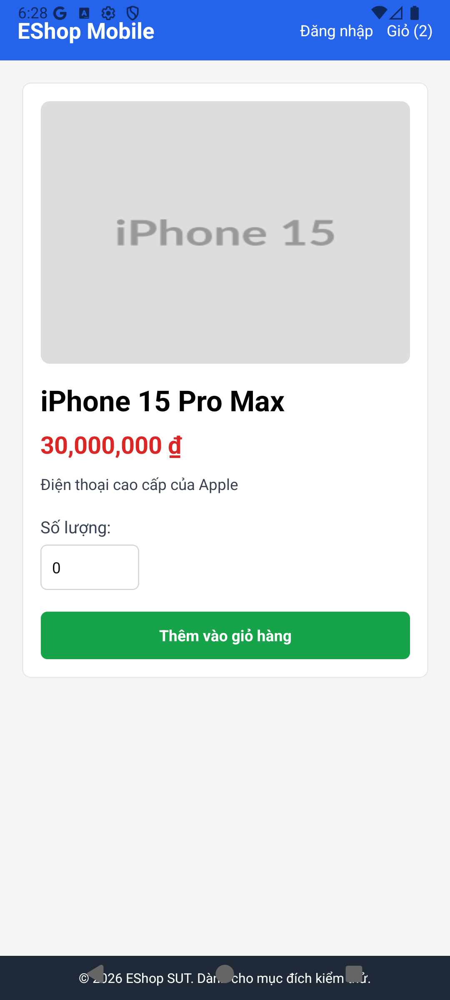
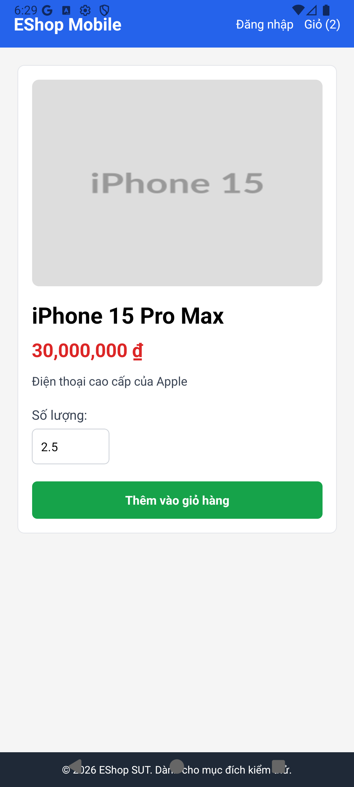

# BUG-001 — Missing Quantity Validation / Coercion Flaw

**Bug ID:** BUG-FR20-001  
**Feature:** FR-20 — Xem sản phẩm (Mobile)  
**Date Reported:** 2026-07-07  
**Reported By:** AI (Antigravity) via EXEC-01  
**Linked Test Cases:** TC-DT-004, TC-DT-005, TC-DT-006, TC-DT-007  
**Severity:** Medium  

---

## Title

Mobile quantity input lacks validation error feedback and silently normalizes zero, negative, empty, or non-numeric inputs to `1` (or truncates decimal inputs).

---

## Environment

| Item | Value |
|------|-------|
| Target Platform | Android (Expo Go) |
| Device Type | Android Emulator |
| Device Model | emulator-5554 |
| Android Version | 16 |
| Backend | http://localhost:3000 |

---

## Preconditions

1. EShop Mobile app is running.
2. The product detail page (e.g. for product ID `1`) is loaded successfully.

---

## Steps to Reproduce

1. Focus the "Số lượng:" text input.
2. Type or paste an invalid input:
   - Case A (Zero): `0`
   - Case B (Negative): `-5`
   - Case C (Decimal): `2.5`
   - Case D (Non-numeric): `abc` (or clear the text input to make it empty)
3. Click the "Thêm vào giỏ hàng" button.
4. Observe the SUT's reaction (Alerts, button text, and cart quantity change).

---

## Expected Result

- SUT displays a user-friendly validation error message (e.g. *"Số lượng phải là số nguyên lớn hơn 0"*) and blocks the addition of the product to the shopping cart.

---

## Actual Result

- SUT does not show any validation error.
- SUT displays the native dialog alert `"Thành công: Đã thêm vào giỏ hàng"`.
- SUT silently normalizes/coerces the inputs:
  - Case A (`0`): Normalizes to `1` item added to cart.
  - Case B (`-5`): Normalizes to `1` item added to cart.
  - Case C (`2.5`): Truncates to `2` items added to cart.
  - Case D (`abc` or empty): Normalizes to `1` item added to cart.

---

## Severity Assessment

**Medium**

- **Functional impact:** While it prevents system crash and SQL/database failures, it bypasses basic form validation guidelines. Silent coercion leads to poor user UX, as the user is misled into thinking their specified input (e.g., zero or a custom quantity) was accepted when the SUT actually added 1 item instead.
- **Workaround:** None.

---

## GitHub Issue Draft

```markdown
## [BUG] FR-20: Quantity text input silently normalizes invalid inputs instead of validating

**Severity:** Medium  
**Platform:** Android (Expo Mobile Client)  

### Description
The quantity input field on the product details page does not validate user inputs (such as 0, negative values, decimals, empty input, or text). When clicking "Thêm vào giỏ hàng", the SUT silently coerces the value (using `parseInt`) to `1` (or truncates decimals) and succeeds, rather than displaying validation feedback.

### Steps to Reproduce
1. Navigate to the product details screen.
2. Enter `0` or `-5` or `abc` in the quantity field.
3. Click "Thêm vào giỏ hàng".
4. Check the shopping cart quantity.

### Expected Behaviour
The system should show an error popup "Vui lòng nhập số lượng hợp lệ (lớn hơn 0)" and prevent adding to the cart.

### Actual Behaviour
The system shows "Thành công: Đã thêm vào giỏ hàng" and adds 1 item to the cart.
```

---

## Reproducibility

✅ **Confirmed reproducible** — Reproduces consistently on the Android Emulator via ADB automation.

---

## Screenshots

| Case | Evidence Screenshot |
|------|--------------------|
| Zero (`0`) |  |
| Negative (`-5`) |  |
| Decimal (`2.5`) |  |
| Non-numeric (`abc`/empty) |  |
