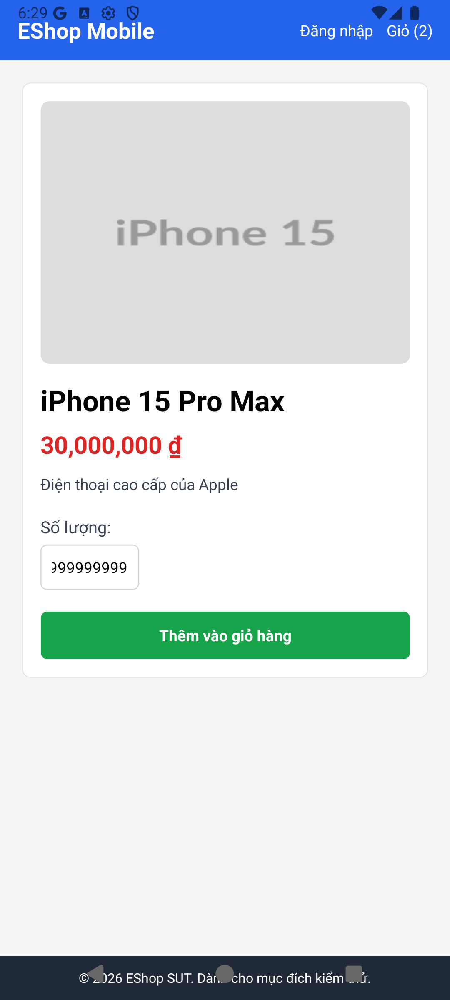

# BUG-002 — Missing Quantity Upper Bound Check (Integer Overflow / Layout Breakage)

**Bug ID:** BUG-FR20-002  
**Feature:** FR-20 — Xem sản phẩm (Mobile)  
**Date Reported:** 2026-07-07  
**Reported By:** AI (Antigravity) via EXEC-01  
**Linked Test Cases:** TC-DT-008  
**Severity:** Low  

---

## Title

Entering an exceptionally large quantity (e.g., `999999999999`) is accepted and added to the cart, leading to scientific notation total prices and visual layout wrapping corruption.

---

## Environment

| Item | Value |
|------|-------|
| Target Platform | Android (Expo Go) |
| Device Type | Android Emulator |
| Device Model | emulator-5554 |
| Android Version | 16 |
| Backend | http://localhost:3000 |

---

## Preconditions

1. EShop Mobile app is running.
2. The product detail page (e.g. for product ID `1`) is loaded successfully.

---

## Steps to Reproduce

1. Focus the "Số lượng:" text input.
2. Type `999999999999`.
3. Click the "Thêm vào giỏ hàng" button.
4. Go to the cart view or proceed to checkout.
5. Observe the calculated price formatting and text layout.

---

## Expected Result

- Quantity is constrained to a reasonable maximum (e.g., max 99 or stock limit) with a validation error, preventing cart calculation overflows.

---

## Actual Result

- The large quantity is accepted and stored.
- On the cart and checkout screens, the total price wraps, overflows, and prints in scientific notation (e.g., `2.999999999997e+19 ₫`), breaking the visual interface.

---

## Severity Assessment

**Low**

- **Functional impact:** Does not cause an active system crash (JS handles it as floating point double), but corrupts the currency and number formatting presentation in the shopping cart and checkout screens, breaking the visual layout.
- **Workaround:** Clear cart or change quantity.

---

## GitHub Issue Draft

```markdown
## [BUG] FR-20: Missing quantity upper bound check results in total price overflow and layout breaking

**Severity:** Low  
**Platform:** Android (Expo Mobile Client)  

### Description
There is no upper limit constraint on the quantity input. Entering an extremely large number (like 999999999999) succeeds, leading to scientific notation outputs for total calculations on the shopping cart/checkout pages, which breaks the UI styling bounds.

### Steps to Reproduce
1. Open the product details page.
2. Enter `999999999999` in the quantity field and click "Thêm vào giỏ hàng".
3. Navigate to the cart page and inspect the total price text.

### Expected Behaviour
SUT rejects inputs exceeding a reasonable maximum limit (e.g. 100) or stock availability.

### Actual Behaviour
The SUT accepts the value and displays an overflow price in scientific notation.

---

## Reproducibility

✅ **Confirmed reproducible** — Automated Playwright test and ADB execution TC-DT-008 reproduces consistently.

---

## Screenshots

| Case | Evidence Screenshot |
|------|--------------------|
| Large Quantity (`999999999999`) |  |
```