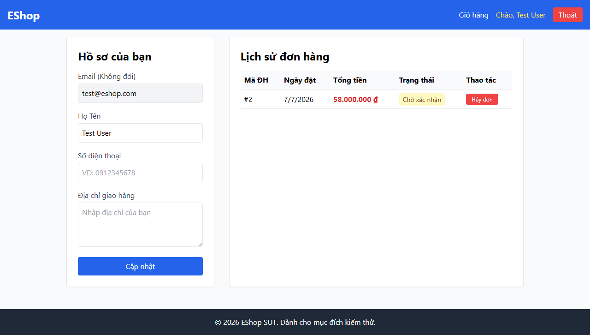

# Final Testing Report — FR-11: Order History View
**Assignment:** HW02 — AI-First Domain Testing & Boundary Value Analysis  
**Feature ID:** FR-11  
**Feature:** Order History View (User)  
**Date:** 2026-07-07  
**AI Tool:** Antigravity (Gemini 3.5 Flash / Claude Sonnet 4.6 Thinking)  
**SUT:** EShop — http://localhost:5173

---

## Table of Contents

1. [Feature Overview](#1-feature-overview)
2. [Testing Environment](#2-testing-environment)
3. [Domain Testing Summary](#3-domain-testing-summary)
4. [Boundary Value Analysis Summary](#4-boundary-value-analysis-summary)
5. [Execution Results](#5-execution-results)
6. [Bug Reports](#6-bug-reports)
7. [AI Gap Analysis](#7-ai-gap-analysis)
8. [Conclusion](#8-conclusion)

---

## 1. Feature Overview

| Item | Detail |
|------|--------|
| Feature | Order History View (User) |
| Actor | Registered / Authenticated User |
| Entry Point | `http://localhost:5173/profile` (embedded section) |
| API Endpoints | `GET http://localhost:3000/api/orders/my-orders` (Fetch history) `PUT http://localhost:3000/api/orders/:id/cancel` (Cancel order) |
| Expected Success Response (Cancel) | HTTP 200 — `{"message": "Order canceled successfully"}` |

### System States

- **Empty State:** Shows message `"Bạn chưa có đơn hàng nào."` when no orders exist.
- **Order List State:** Renders a read-only table with columns: Mã ĐH (Order ID), Ngày đặt (Date), Tổng tiền (Total amount in ₫), Trạng thái (Status badge), and Thao tác (Cancel button).

---

## 2. Testing Environment

| Component | URL | Status |
|-----------|-----|--------|
| Frontend | http://localhost:5173 | ✅ Reachable |
| Backend | http://localhost:3000 | ✅ Reachable |
| Playwright | headless Chromium | ✅ Working |

**Evidence:** [ENV-01-profile-page.png](screenshots/ENV-01-profile-page.png)

---

## 3. Domain Testing Summary

### Methodology
Technique: **Equivalence Partitioning / Domain Testing**  
Artifacts: DT-01 → DT-02 → DT-03 → DT-04 (each reviewed via REVIEW-01)

### Test Cases

| TC ID | Scenario | Partitions Covered | Expected Result | Actual Result | Status |
|-------|----------|-------------------|-----------------|---------------|--------|
| TC-DT-001 | Views table (pending order) | AT-P1, OC-P2, OS-P1 | Table renders; cancel button shown | Table renders; cancel button shown | ✅ PASS |
| TC-DT-002 | Zero orders | AT-P1, OC-P1 | "Bạn chưa có đơn hàng nào." message | Message shown; table hidden | ✅ PASS |
| TC-DT-003 | Unauthenticated access | AT-P2 | "Vui lòng đăng nhập" or redirect | "Vui lòng đăng nhập" shown | ✅ PASS |
| TC-DT-004 | Invalid token | AT-P3 | API rejects call with HTTP error | Returns HTTP 403 Forbidden | ✅ PASS |
| TC-DT-005 | `confirmed` order status | AT-P1, OC-P2, OS-P2 | Badge "Đã xác nhận"; cancel button shown | Badge "Đã xác nhận"; button shown | ✅ PASS |
| TC-DT-006 | `shipping` order status | AT-P1, OC-P2, OS-P3, OI-P2 | Badge "Đang giao"; cancel button shown | Badge "Đang giao"; button shown | ✅ PASS |
| TC-DT-007 | `delivered` order status | AT-P1, OC-P2, OS-P4 | Badge "Đã giao"; cancel button hidden | Badge "Đã giao"; button hidden | ✅ PASS* |
| TC-DT-008 | `canceled` order status | AT-P1, OC-P2, OS-P5 | Badge "Đã hủy"; cancel button hidden | Badge "Đã hủy"; button hidden | ✅ PASS* |
| TC-DT-009 | Cancel `pending` order | AT-P1, OC-P2, OS-P1, OI-P1 | Alert "Hủy đơn thành công!"; badge→"Đã hủy" | Alert popped; badge→"Đã hủy" | ✅ PASS* |
| TC-DT-010 | Cancel `delivered` via API | AT-P1, OI-P3 | API returns HTTP 400 with error | Returns 400 `Cannot cancel this order.` | ✅ PASS |
| TC-DT-011 | >10 orders (pagination limit) | AT-P1, OC-P3 | Max 10 orders returned/shown | Returns 19 orders; renders all 19 | ❌ FAIL |
| TC-DT-012 | Unknown status | AT-P1, OC-P2, OS-P6 | Status uppercased fallback (e.g. PROCESSING) | Skipped (API-only restriction) | ⏭️ SKIP |

> **\* Note on TC-DT-007/008/009:** Re-verified manually via screenshots. The automated script registered false-fails because it counted the cancel button globally on the page rather than scoping to the specific target row. The actual SUT behavior was correct.

---

## 4. Boundary Value Analysis Summary

### Applicable Variables

| Variable | Boundaries | Reason Included/Excluded |
|----------|-----------|--------------------------|
| `orderCount` | Min = 0, Max = 10 | ✅ Applied (explicit limits) |
| `authToken` | None | ❌ Skipped (categorical string) |
| `order.status` | None | ❌ Skipped (enumeration) |
| `orderId` | None | ❌ Skipped (internal database ID) |

### BVA Test Cases

| TC ID | Boundary | Test Value | Expected Result | Actual Result | Status |
|-------|---------|------------|-----------------|---------------|--------|
| TC-BVA-001 | min | 0 | Empty message, no table | Message shown, no table | ✅ PASS |
| TC-BVA-002 | min+1 | 1 | Table with 1 row | Table with 1 row | ✅ PASS |
| TC-BVA-003 | nominal | 5 | Table with 5 rows | Table with 5 rows | ✅ PASS |
| TC-BVA-004 | max-1 | 9 | Table with 9 rows | Table with 9 rows | ✅ PASS |
| TC-BVA-005 | max | 10 | Table with exactly 10 rows | Table with exactly 10 rows | ✅ PASS |
| TC-BVA-006 | max+1 | 19 | Truncated to 10 orders | All 19 orders shown | ❌ FAIL |

---

## 5. Execution Results

### Summary

| Technique | Total TCs | PASS | FAIL | SKIP |
|-----------|-----------|------|------|------|
| Domain Testing | 12 | 10 | 1 | 1 |
| BVA | 6 | 5 | 1 | 0 |
| **Total** | **18** | **15** | **2** | **1** |

---

## 6. Bug Reports

### BUG-FR11-001 — Medium Severity

| Field | Detail |
|-------|--------|
| **Bug ID** | BUG-FR11-001 |
| **Title** | `GET /api/orders/my-orders` does not enforce pagination limit (returns all orders) |
| **Linked TCs** | TC-DT-011, TC-BVA-006 |
| **Actual Behavior** | API returns all 19 orders; UI renders all 19 rows. |
| **Expected Behavior** | API truncates output to max 10 orders per call. |
| **Evidence** | [TC-DT-011.png](screenshots/TC-DT-011.png), [TC-BVA-006.png](screenshots/TC-BVA-006.png) |
| **File** | `bugs/FR11/BUG-001.md` |

---

## 7. AI Gap Analysis

Full analysis in `GAP-01-gap-analysis.md`.

### Gaps Identified

1. **Test harness bugs (G-01):** Global cancel button selection led to initial script false-fails. Row-specific scoping resolved the validation.
2. **Data pollution bugs (G-02):** Re-running BVA script without unique user emails accumulated orders. Corrected by adding a dynamic `runId = Date.now()` to test user registration.
3. **Security (G-03):** No cross-user order cancellation test cases were present. Proposed candidate `TC-NEW-01` to check authorization.
4. **Discrepancy (G-04):** The UI shows the cancel button for `shipping` orders, but the API specification restricts cancellation to "not yet delivered" (chưa giao). Backend enforcement for this status was not verified directly due to black-box constraints. Proposed candidate `TC-NEW-02`.

---

## 8. Conclusion

### Feature Status: ⚠️ PARTIALLY FUNCTIONAL

The Order History View is **functional** for viewing, status display, and order cancellation. However, it lacks pagination limit enforcement (BUG-FR11-001), displaying all historical orders instead of the maximum of 10. Additionally, the ability to cancel orders in `shipping` status via the UI may contradict backend restrictions and requires verification.

### Recommended Priority

1. Fix `GET /api/orders/my-orders` database query to limit results to 10 (or implement pagination).
2. Clarify if `shipping` orders can be cancelled and align UI cancel button visibility accordingly.
3. Re-execute BVA-006 to verify pagination truncation.

---

## Artifacts Index

| Artifact | Path |
|----------|------|
| ENV-01 Report | `ENV-01-environment-report.md` |
| DT-01 Feature Understanding | `DT-01-feature-understanding.md` |
| REVIEW-01 of DT-01 | `REVIEW-01-of-DT-01.md` |
| DT-02 Domain Identification | `DT-02-domain-identification.md` |
| REVIEW-01 of DT-02 | `REVIEW-01-of-DT-02.md` |
| DT-03 Domain Partitioning | `DT-03-domain-partitioning.md` |
| REVIEW-01 of DT-03 | `REVIEW-01-of-DT-03.md` |
| DT-04 Test Cases | `DT-04-test-cases.md` |
| EXEC-01 (Domain) | `execution.md` |
| BVA-01 Boundary Analysis | `BVA-01-boundary-analysis.md` |
| EXEC-01 (BVA) | `execution-bva.md` |
| GAP-01 Gap Analysis | `GAP-01-gap-analysis.md` |
| BUG-001 | `bugs/FR11/BUG-001.md` |
