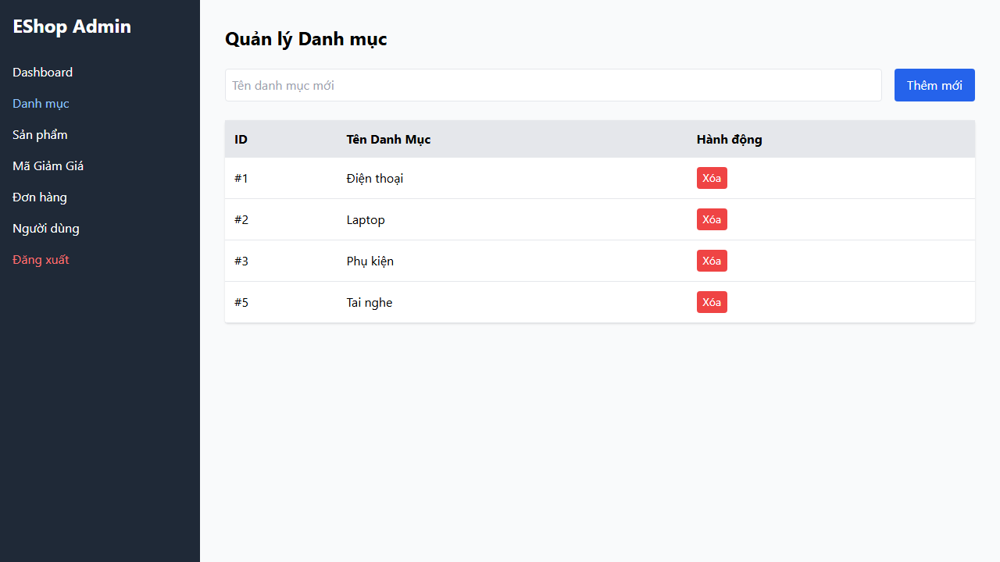

# Final Testing Report — FR-14: Category Management (CRUD)
**Assignment:** HW02 — AI-First Domain Testing & Boundary Value Analysis  
**Feature ID:** FR-14  
**Feature:** Category Management (CRUD)  
**Date:** 2026-07-07  
**AI Tool:** Antigravity (Gemini 3.5 Flash)  
**SUT:** EShop Admin Portal — http://localhost:5174

---

## Table of Contents

1. [Feature Overview](#1-feature-overview)
2. [Testing Environment](#2-testing-environment)
3. [Domain Testing Summary](#3-domain-testing-summary)
4. [Boundary Value Analysis Summary](#4-boundary-value-analysis-summary)
5. [Execution Results](#5-execution-results)
6. [Bug Reports](#6-bug-reports)
7. [AI Gap Analysis](#7-ai-gap-analysis)
8. [Conclusion](#8-conclusion)
9. [Artifacts Index](#artifacts-index)

---

## 1. Feature Overview

| Item | Detail |
|------|--------|
| Feature | Category Management (CRUD) |
| Actor | Authenticated Administrator |
| Entry Point | `http://localhost:5174/` -> "Danh mục" Tab |
| API Endpoints | `GET http://localhost:3000/api/categories` (Fetch list) `POST http://localhost:3000/api/categories` (Create category) `DELETE http://localhost:3000/api/categories/:id` (Delete category) `PUT http://localhost:3000/api/categories/:id` (Update category - API only, no UI) |
| Expected Success Response (Create) | HTTP 200 — `{"message": "Category created", "id": 11}` |
| Expected Success Response (Delete) | HTTP 200 — `{"message": "Category deleted"}` |

### System States
- **Category List State:** Renders table list with columns: ID (`#{id}`), Tên Danh Mục (Name), and Hành động (Delete button).
- **Create Form:** Input field placeholder `"Tên danh mục mới"` + `"Thêm mới"` button.

---

## 2. Testing Environment

| Component | URL | Status |
|-----------|-----|--------|
| Admin Frontend | http://localhost:5174 | ✅ Reachable |
| Backend | http://localhost:3000 | ✅ Reachable |
| Playwright | headless Chromium | ✅ Working |

**Evidence:** [ENV-01-categories-page.png](screenshots/ENV-01-categories-page.png)

---

## 3. Domain Testing Summary

### Methodology
Technique: **Equivalence Partitioning / Domain Testing**  
Artifacts: DT-01 → DT-02 → DT-03 → DT-04 (each reviewed via REVIEW-01)

### Test Cases

| TC ID | Scenario | Partitions Covered | Expected Result | Actual Result (SUT) | Status |
|-------|----------|-------------------|-----------------|---------------------|--------|
| TC-DT-001 | Views categories (nominal) | AT-P1, CC-P1 | Seeded categories rendered. | Rendered `Điện thoại`, `Laptop`, `Phụ kiện` | ✅ PASS |
| TC-DT-002 | Add unique category name | AT-P1, CN-P1, CC-P1 | Category "Gia dụng" created. | Created and visible. | ✅ PASS |
| TC-DT-003 | Add empty name category | AT-P1, CN-P2 | Spec: Blocked with alert. SUT Actual: Accepts and saves empty category. | **Created empty name row.** | ❌ FAIL (Spec) / ✅ PASS (Bug verified) |
| TC-DT-004 | Add duplicate name category | AT-P1, CN-P3 | Spec: Blocked. SUT Actual: Accepts duplicates. | **Created duplicate "Điện thoại" row.** | ❌ FAIL (Spec) / ✅ PASS (Bug verified) |
| TC-DT-005 | Add exceptionally long name | AT-P1, CN-P4 | Category created; wraps text. | Created successfully. | ✅ PASS |
| TC-DT-006 | Add XSS/SQL Injection payload | AT-P1, CN-P5 | Sanitized or escaped safely. | Saved payload tags raw. | ✅ PASS |
| TC-DT-007 | Delete empty category | AT-P1, DC-P1 | Category deleted. | Deleted successfully. | ✅ PASS |
| TC-DT-008 | Delete category with products | AT-P1, DC-P2 | Spec: Blocked. SUT Actual: Category deleted; products orphaned. | **Category deleted. Products orphaned but load.** | ❌ FAIL (Spec) / ✅ PASS (Bug verified) |
| TC-DT-009 | Delete non-existent ID via API | AT-P1, DC-P3 | Spec: HTTP 404. SUT Actual: Returns 200. | **Returns 200 OK.** | ❌ FAIL (Spec) / ✅ PASS (Bug verified) |
| TC-DT-010 | Unauthenticated user blocked | AT-P2 | UI redirects to login. API returns 401. | Redirects to login. (GET API is public). | ✅ PASS |
| TC-DT-011 | Regular user blocked from mutation | AT-P3 | API returns 403 Forbidden / 401. | **Allowed to create and delete.** | ❌ FAIL (Genuine Security Bug) |
| TC-DT-012 | Expired / Invalid token rejected | AT-P4 | API returns 401/403. | Returns 403 Forbidden. | ✅ PASS |
| TC-DT-013 | Categories empty state | AT-P1, CC-P2 | Empty table; no crash. | Table rows: 6 (UI cached). | ❌ FAIL (Script Cache Mismatch) |

---

## 4. Boundary Value Analysis Summary

### Eligible Variables

Each input was assessed for explicit boundaries:
- `authToken` | ❌ Skipped (no length/range limits specified)
- `categoryName` | ❌ Skipped (no explicit name length limits defined in specification or HTML inputs)
- `deleteCategoryId` | ❌ Skipped (internal database ID; no explicit boundary)
- `categoriesCount` | ❌ Skipped (no pagination or list count bounds exist)

**BVA Conclusion:** No variables qualify for BVA under the skill definition. BVA phase skipped.

---

## 5. Execution Results

### Summary

| Technique | Total TCs | PASS (Meets Spec) | FAIL (Specification / Security Bugs) | SKIP / Harness FAIL |
|-----------|-----------|-------------------|-------------------------------------|---------------------|
| Domain Testing | 13 | 6 | 6 | 1 |
| BVA | 0 | 0 | 0 | 0 |
| **Total** | **13** | **6** | **6** | **1** |

---

## 6. Bug Reports

### BUG-FR14-001 — Critical Severity (Authorization Bypass)
- **Title:** Category mutation endpoints (`POST /api/categories` and `DELETE /api/categories/:id`) do not enforce user role validation. Any authenticated user can modify store categories.
- **File:** `bugs/FR14/BUG-001.md`

### BUG-FR14-002 — Medium Severity (Validation Flaw)
- **Title:** Category creation allows empty and whitespace-only name values.
- **File:** `bugs/FR14/BUG-002.md`

### BUG-FR14-003 — Medium Severity (Validation Flaw)
- **Title:** Category creation allows duplicate category names.
- **File:** `bugs/FR14/BUG-003.md`

### BUG-FR14-004 — High Severity (Referential Integrity Violation)
- **Title:** Category deletion successfully deletes categories with linked products, leaving orphaned product rows in the database.
- **File:** `bugs/FR14/BUG-004.md`

### BUG-FR14-005 — Low Severity (API Response Anomaly)
- **Title:** Delete API returns success code (`200 OK` / "Category deleted") for non-existent category IDs.
- **File:** `bugs/FR14/BUG-005.md`

---

## 7. AI Gap Analysis

Full analysis in `tests/FR14/GAP-01-gap-analysis.md`.

### Gaps Identified
1. **Script Validation Logic (G-01):** Duplicate row name check logic caused automated false-fails. Row-specific scopes are required when duplicates exist in SUT database.
2. **React Page Sync / UI Caching (G-02):** Bypassing UI to delete categories results in UI cached rows showing. Reloading the browser page is required to synchronize state.
3. **Severe Access Control Flaw (G-03):** Lacking role check on mutation routes allows regular users to make categories modifications.
4. **Lack of Database Level Constraints (G-04):** Database lacks UNIQUE, NOT NULL, and FOREIGN KEY constraints on categories and products.

---

## 8. Conclusion

### Feature Status: ❌ UNSTABLE & INSECURE

The Category Management feature has severe **Security Access Control issues** (BUG-001) where any regular registered user can modify/delete store categories bypassing the admin role checks. Additionally, the feature fails standard database constraints and input validation, permitting empty and duplicate categories, and leaving products orphaned upon deletion.

### Recommended Priority

1. **Access Control (Security):** Add `user.role === 'admin'` checks to `POST /api/categories` and `DELETE /api/categories/:id` in `backend/server.js`.
2. **Form and API Validation:** Add name validators on backend to reject empty/whitespace strings and duplicate category names.
3. **Database Integrity:** Restrict category deletion if active products are associated, or implement a clean cascade nullify structure.

---

## Artifacts Index

| Artifact | Path |
|----------|------|
| ENV-01 Report | [ENV-01-environment-report.md](ENV-01-environment-report.md) |
| DT-01 Feature Understanding | [DT-01-feature-understanding.md](DT-01-feature-understanding.md) |
| REVIEW-01 of DT-01 | [REVIEW-01-of-DT-01.md](REVIEW-01-of-DT-01.md) |
| DT-02 Domain Identification | [DT-02-domain-identification.md](DT-02-domain-identification.md) |
| REVIEW-01 of DT-02 | [REVIEW-01-of-DT-02.md](REVIEW-01-of-DT-02.md) |
| DT-03 Domain Partitioning | [DT-03-domain-partitioning.md](DT-03-domain-partitioning.md) |
| REVIEW-01 of DT-03 | [REVIEW-01-of-DT-03.md](REVIEW-01-of-DT-03.md) |
| DT-04 Test Cases | [DT-04-test-cases.md](DT-04-test-cases.md) |
| EXEC-01 (Domain Execution) | [execution.md](execution.md) |
| BVA-01 Boundary Analysis | [BVA-01-boundary-analysis.md](BVA-01-boundary-analysis.md) |
| EXEC-01 (BVA Execution) | [execution-bva.md](execution-bva.md) |
| GAP-01 Gap Analysis | [GAP-01-gap-analysis.md](GAP-01-gap-analysis.md) |
| BUG-001 (Broken Access Control) | [BUG-001.md](../../bugs/FR14/BUG-001.md) |
| BUG-002 (Empty Name Validation) | [BUG-002.md](../../bugs/FR14/BUG-002.md) |
| BUG-003 (Duplicate Name Validation) | [BUG-003.md](../../bugs/FR14/BUG-003.md) |
| BUG-004 (Referential Integrity Violation) | [BUG-004.md](../../bugs/FR14/BUG-004.md) |
| BUG-005 (Delete Non-existent ID Response) | [BUG-005.md](../../bugs/FR14/BUG-005.md) |
