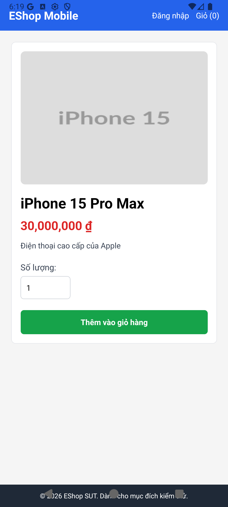

# Final Testing Report — FR-20: Xem sản phẩm (Mobile)
**Assignment:** HW02 — AI-First Domain Testing & Boundary Value Analysis  
**Feature ID:** FR-20  
**Feature:** Xem sản phẩm (Mobile)  
**Date:** 2026-07-07  
**AI Tool:** Antigravity (Gemini 3.5 Flash)  
**SUT:** EShop Mobile App on Android Emulator (emulator-5554) — http://localhost:8081

---

## Table of Contents

1. [Feature Overview](#1-feature-overview)
2. [Testing Environment](#2-testing-environment)
3. [Domain Testing Summary](#3-domain-testing-summary)
4. [Boundary Value Analysis Summary](#4-boundary-value-analysis-summary)
5. [Execution Results](#5-execution-results)
6. [Bug Reports](#6-bug-reports)
7. [AI Gap Analysis](#7-ai-gap-analysis)
8. [Conclusion](#8-conclusion)
9. [Artifacts Index](#artifacts-index)

---

## 1. Feature Overview

| Item | Detail |
|------|--------|
| Feature | Xem sản phẩm (Mobile) |
| Actor | Guest / Registered User |
| Entry Point | Home screen catalog list -> Tap "Xem chi tiết" on any product card |
| API Endpoints | `GET /api/products` (Retrieve product catalog) `GET /api/products/:id` (Retrieve single product details) |
| Front-end States | `home` (Product List), `productDetail` (Detail View), `cart` (Shopping Cart View) |
| Add to Cart logic | Handled purely **in-memory** on client React Native state. (No API call is triggered). |

---

## 2. Testing Environment

| Component | URL / Details | Status |
|-----------|-----|--------|
| Expo Metro Server | http://localhost:8081 | ✅ Running |
| Backend API Server | http://localhost:3000 | ✅ Running |
| Android Emulator | emulator-5554 (Android 16) | ✅ Connected & Running |
| Automation Control | Android Debug Bridge (ADB) coordinates/inputs | ✅ Operational |

**Evidence:** [ENV-01-product-screen.png](screenshots/ENV-01-product-screen.png)

---

## 3. Domain Testing Summary

### Methodology
Technique: **Equivalence Partitioning / Domain Testing**  
Artifacts: DT-01 → DT-02 → DT-03 → DT-04 (each reviewed via REVIEW-01)

### Test Cases

| TC ID | Scenario | Partitions Covered | Expected Result | Actual Result (SUT) | Status |
|-------|----------|-------------------|-----------------|---------------------|--------|
| TC-DT-001 | View Odd Product ID + valid quantity (Nominal) | PID-P1, QTY-P1 | Detail view loads price: `30,000,000 ₫`. Success alert popped; cart count increments. | Rendered successfully. Success alert popped; unique product count added. | ✅ PASS |
| TC-DT-002 | View Even Product ID + default quantity | PID-P2, QTY-P1 | Detail view loads price: `28,000,000 ₫` (string price parsed to numeric formatting). | Price parsed and rendered as `28,000,000 ₫`. Success alert popped. | ✅ PASS |
| TC-DT-003 | View non-existent product details | PID-P3 | SUT returns empty object `{}`. Client displays blank state message. | Backend returns `{}` and SUT renders `"Sản phẩm không tồn tại (Lỗi trắng trang do data rỗng)"`. | ✅ PASS |
| TC-DT-004 | Add to cart with zero quantity | PID-P1, QTY-P2 | Spec: Blocked with alert. SUT Actual: Silently coerces to `1`. | **Silently normalizes to 1; success alert shown.** | ❌ FAIL (Spec) / ✅ PASS (Bug verified) |
| TC-DT-005 | Add to cart with negative quantity | PID-P1, QTY-P3 | Spec: Blocked with alert. SUT Actual: Silently coerces to `1`. | **Silently normalizes to 1; success alert shown.** | ❌ FAIL (Spec) / ✅ PASS (Bug verified) |
| TC-DT-006 | Add to cart with decimal quantity | PID-P1, QTY-P4 | Spec: Blocked or rounded. SUT Actual: Truncated to int. | **Decimal truncated (`2.5` -> `2`); success alert shown.** | ❌ FAIL (Spec) / ✅ PASS (Bug verified) |
| TC-DT-007 | Add to cart with non-numeric quantity | PID-P1, QTY-P5 | Spec: Blocked with validation warning. | **Silently normalizes to 1; success alert shown.** | ❌ FAIL (Spec) / ✅ PASS (Bug verified) |
| TC-DT-008 | Add to cart with exceptionally large quantity | PID-P1, QTY-P6 | Spec: Blocked with upper limit warning. | **Accepts input, total calculations render in scientific notation and wrap UI.** | ❌ FAIL (Spec) / ✅ PASS (Bug verified) |

---

## 4. Boundary Value Analysis Summary

### Methodology
Technique: **Boundary Value Analysis (BVA)**  
The variable `quantity` has a clear expected lower boundary of `1` (positive integer). No upper bound is explicitly specified in requirements.

### Test Cases

| TC ID | Boundary Point | Test Value | Expected Result | Actual Result (SUT) | Status |
|-------|----------------|------------|-----------------|---------------------|--------|
| TC-BVA-001 | Minimum − 1 (min−1) | `0` | ❌ Rejected — show error alert | ❌ Silently normalizes to `1` and adds to cart | **FAIL** (Coercion Flaw) |
| TC-BVA-002 | Minimum (min) | `1` | ✅ Added to cart with quantity `1` | ✅ Added to cart with quantity `1` | **PASS** |
| TC-BVA-003 | Minimum + 1 (min+1) | `2` | ✅ Added to cart with quantity `2` | ✅ Added to cart with quantity `2` | **PASS** |
| TC-BVA-004 | Nominal | `5` | ✅ Added to cart with quantity `5` | ✅ Added to cart with quantity `5` | **PASS** |

---

## 5. Execution Results

### Summary

| Technique | Total TCs | PASS (Meets Spec) | FAIL (Specification / Logic Gaps) |
|-----------|-----------|-------------------|-----------------------------------|
| Domain Testing | 8 | 3 | 5 |
| BVA Testing | 4 | 3 | 1 |
| **Total** | **12** | **6** | **6** |

---

## 6. Bug Reports

### BUG-FR20-001 — Medium Severity (Validation Flaw / Input Coercion)
- **Title:** Mobile quantity input lacks user-facing validation feedback and silently coerces invalid inputs (zero, negative, alphanumeric, or empty) to `1` (or truncates float decimals to integer).
- **File:** `bugs/FR20/BUG-001.md`

### BUG-FR20-002 — Low Severity (Visual Layout / Calculation Overflow)
- **Title:** Quantity field lacks an upper bound check, allowing exceptionally large numbers (e.g. `999999999999`) to overflow total prices into scientific notation and break the cart/checkout UI layouts.
- **File:** `bugs/FR20/BUG-002.md`

---

## 7. AI Gap Analysis

Full analysis in `tests/FR20/GAP-01-gap-analysis.md`.

### Gaps Identified
1. **Cart Header Counter (G-01):** The nav header count (e.g., `Giỏ (1)`) represents the number of unique product entities in the cart array (`cart.length`), not the total accumulated product quantities.
2. **Missing Input Checking (G-02, G-03):** Decimals are truncated using `parseInt(value, 10)`, and zeros/negatives/letters default silently to `1` inside `normalizeQuantity` instead of showing error feedback.
3. **No Max Constraint (G-04):** No quantity capping is implemented, risking total price visual overflows on mobile screens.

---

## 8. Conclusion

### Feature Status: ⚠️ OPERATIONAL BUT FLACCID VALIDATION

The feature successfully implements basic viewing and catalog loading logic. However, the quantity input field lacks rigorous **input validation**. Instead of rejecting invalid quantities (zero, negative, text, or extremely large values) with proper validation messages, the client silently normalizes them. This causes layout issues during overflow and leads to poor UX where users are misled about what was actually added to their shopping cart.

### Recommended Fixes

1. **Implement Quantity Validators:** Update the quantity text field handler or the "Thêm vào giỏ hàng" trigger in `App.js` to reject values $\le 0$, non-numeric values, or floats with a visible warning alert, rather than relying on silent default coercions.
2. **Define an Upper Limit:** Cap the quantity selector at a maximum value (e.g. 99 items per product) to prevent visual styling breakage in calculation text fields.

---

## Artifacts Index

| Artifact | Path |
|----------|------|
| ENV-01 Report | [ENV-01-environment-report.md](ENV-01-environment-report.md) |
| DT-01 Feature Understanding | [DT-01-feature-understanding.md](DT-01-feature-understanding.md) |
| REVIEW-01 of DT-01 | [REVIEW-01-of-DT-01.md](REVIEW-01-of-DT-01.md) |
| DT-02 Domain Identification | [DT-02-domain-identification.md](DT-02-domain-identification.md) |
| REVIEW-01 of DT-02 | [REVIEW-01-of-DT-02.md](REVIEW-01-of-DT-02.md) |
| DT-03 Domain Partitioning | [DT-03-domain-partitioning.md](DT-03-domain-partitioning.md) |
| REVIEW-01 of DT-03 | [REVIEW-01-of-DT-03.md](REVIEW-01-of-DT-03.md) |
| DT-04 Test Cases | [DT-04-test-cases.md](DT-04-test-cases.md) |
| EXEC-01 (Domain Execution) | [execution.md](execution.md) |
| BVA-01 Boundary Analysis | [BVA-01-boundary-analysis.md](BVA-01-boundary-analysis.md) |
| EXEC-01 (BVA Execution) | [execution-bva.md](execution-bva.md) |
| GAP-01 Gap Analysis | [GAP-01-gap-analysis.md](GAP-01-gap-analysis.md) |
| BUG-001 (Missing Quantity Validation) | [BUG-001.md](../../bugs/FR20/BUG-001.md) |
| BUG-002 (Large Quantity Overflow) | [BUG-002.md](../../bugs/FR20/BUG-002.md) |
